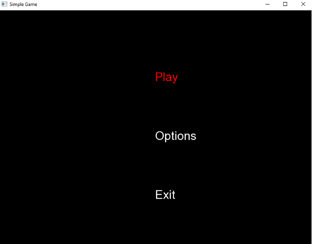

# Hot-Ball

The main goal of the project was to create a simple game with a graphical user interface. The graphical interface was made using SFML. The main goal of the game is to win the prize
on the board. Obstacles move in different directions, making it difficult to achieve the goal. Colliding with an obstacle or reaching the goal is signaled with a special message. After the message appears, you can start the game again by returning to the main menu or end the game by selecting the 'exit' option.

In the Gameplay may be configured difficult level, music which was played in the background, and color of ours player/pawn. Activities related to the selection of the above functionalities can be done in the options menu. 
 

We use arrows to move around the application. Enter is used to confirm and Esc is used to exit the game.

